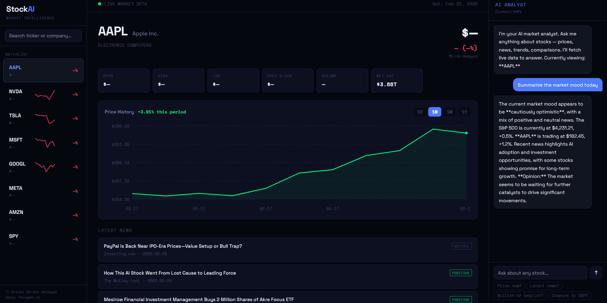
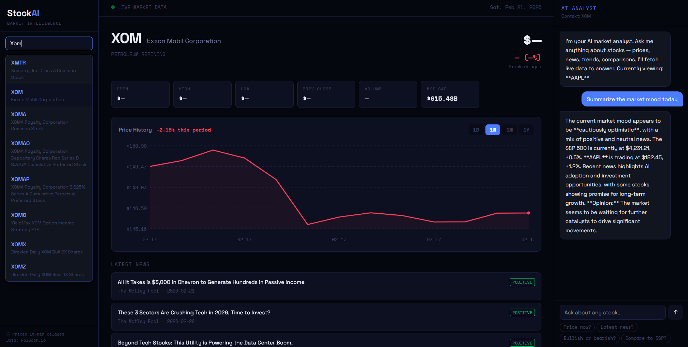

<div align="center">

<br/>



<br/><br/>

# StockAI

**AI-powered stock market dashboard — real-time data, interactive charts, news sentiment, and an AI analyst that fetches live data to answer your questions.**

[](https://python.org)
[](https://fastapi.tiangolo.com)
[](https://react.dev)
[](https://groq.com)
[](https://polygon.io)
[](LICENSE)

</div>

---

## ✨ Features

- 📈 **Live stock dashboard** — price, open, high, low, volume, market cap for any US stock
- 📊 **Interactive price chart** — 1D / 1W / 1M / 1Y toggles with % change for the period
- 🔍 **Search any ticker** — type a company name or symbol, get instant dropdown results
- 📰 **News with sentiment** — latest headlines tagged POSITIVE / NEUTRAL / NEGATIVE
- 👀 **Watchlist** — AAPL, NVDA, TSLA, MSFT, GOOGL, META, AMZN, SPY with live sparklines
- 🤖 **AI analyst with function calling** — ask anything, the AI fetches live data autonomously to answer
- ⚡ **Streaming responses** — analyst answers stream token by token in real time

---

## 🖥️ Screenshots

<div align="center">

### Dashboard + AI Analyst


<br/><br/>

### Search + Analyst Response


</div>

---

## 🏗️ Architecture

```
stockai/
├── backend/
│   ├── main.py       # FastAPI server, all API endpoints
│   ├── market.py     # Polygon.io wrapper — price, history, news, search
│   ├── analyst.py    # AI analyst with function calling + streaming
│   ├── requirements.txt
│   └── .env          # GROQ_API_KEY + POLYGON_API_KEY
│
└── frontend/
    └── index.html    # Full React UI — single file, no build step
```

### Request flow

```
User asks: "Why is NVDA up this week?"
         ↓
FastAPI /chat endpoint
         ↓
LLM receives question + available tools
         ↓
LLM decides: I need get_stock_price("NVDA") + get_stock_news("NVDA")
         ↓
Backend executes both Polygon API calls
         ↓
Results injected back into LLM context
         ↓
LLM generates grounded answer using real data
         ↓
Tokens stream to frontend via SSE
```

---

## 🧠 The Star Feature — Function Calling

Function calling is what separates a basic chatbot from an AI agent.

Without function calling, you'd have to hardcode the logic:
```python
# Hardcoded — rigid, not intelligent
price = get_price(ticker)
news = get_news(ticker)
answer = llm(f"Given price={price} and news={news}, answer: {query}")
```

With function calling, the LLM decides what it needs:
```python
# The LLM sees the tools and chooses autonomously
tools = [get_stock_price, get_stock_news, get_company_info, get_price_history]
# Ask: "Why is Tesla down this month?"
# LLM calls: get_price_history("TSLA", "1M") + get_stock_news("TSLA")
# Ask: "What does Apple do?"
# LLM calls: get_company_info("AAPL") only
# Ask: "Compare NVDA and AMD"
# LLM calls: get_stock_price("NVDA") + get_stock_price("AMD") + get_stock_news("NVDA") + get_stock_news("AMD")
```

The model reasons about what information it needs, calls the right tools, and synthesizes a coherent answer — all autonomously.

---

## 🚀 Getting Started

### Prerequisites

- Python 3.11
- Conda
- Free [Groq API key](https://console.groq.com)
- Free [Polygon.io API key](https://polygon.io) (free tier, no credit card)

### 1. Clone & setup

```bash
git clone https://github.com/yourusername/stockai.git
cd stockai
conda create -n stockai python=3.11
conda activate stockai
```

### 2. Install

```bash
cd backend
pip install -r requirements.txt
```

### 3. Configure

Edit `backend/.env`:
```env
GROQ_API_KEY=gsk_your_key_here
POLYGON_API_KEY=your_polygon_key_here
```

### 4. Run

```bash
python main.py
```

Open **http://localhost:8000**

---

## 🤖 AI Analyst — Example Questions

| Question | Tools called |
|---|---|
| "How is AAPL doing today?" | `get_stock_price` |
| "Latest news on Tesla?" | `get_stock_news` |
| "Why is NVDA up this week?" | `get_stock_price` + `get_stock_news` |
| "Compare Apple and Microsoft" | `get_stock_price` × 2 + `get_stock_news` × 2 |
| "What does Google do?" | `get_company_info` |
| "Summarize the market mood" | `get_stock_price` (SPY + multiple) + `get_stock_news` |

---

## 🛠️ Tech Stack

| Component | Technology | Why |
|---|---|---|
| **Market data** | Polygon.io free tier | Price, history, news, search in one API |
| **LLM** | LLaMA 3.3 70B on Groq | Fast, smart, supports function calling |
| **Function calling** | Groq tool use API | LLM autonomously decides which data to fetch |
| **Streaming** | Server-Sent Events | Token-by-token analyst responses |
| **Backend** | FastAPI + httpx | Async API calls to Polygon |
| **Frontend** | React 18 (no build) | Single HTML file, zero toolchain |

---

## ⚠️ Known Limitations

**Polygon.io free tier:**
- Prices are **15 minutes delayed** — not suitable for active trading
- **5 API calls/minute** rate limit — watchlist loads with staggered requests
- Split-adjusted prices may be incorrect for some tickers (e.g. GOOG post-2022 split)
- **US stocks only** — no international exchanges

> Always verify prices on Google Finance or Yahoo Finance before making any financial decisions. This is a portfolio project, not a trading tool.

---

## 💡 Things I learned building this

- **Function calling is the foundation of AI agents** — instead of hardcoding tool sequences, the LLM reasons about what it needs. This is how production AI assistants like Claude's tool use work under the hood.
- **Multi-turn tool use** — the LLM can call multiple tools in one turn, get all results, then synthesize a single coherent answer. The backend orchestrates this transparently.
- **Rate limiting is real** — financial APIs have strict limits on free tiers. Staggering requests (600ms delay per item) is a simple but effective solution.
- **Data quality matters** — free tier data can be stale or incorrectly adjusted. In production you'd add validation layers and fallback sources.
- **SSE vs WebSockets** — SSE is perfect for one-way streaming (server → client). We used WebSockets in Day 1 (VoiceAI) because audio needed bidirectional flow. Picking the right protocol matters.

---

## 📄 License

MIT — do whatever you want with it.

---

<div align="center">
  <sub>Built as Day 4 of a 30-day AI challenge 🚀</sub>
</div>